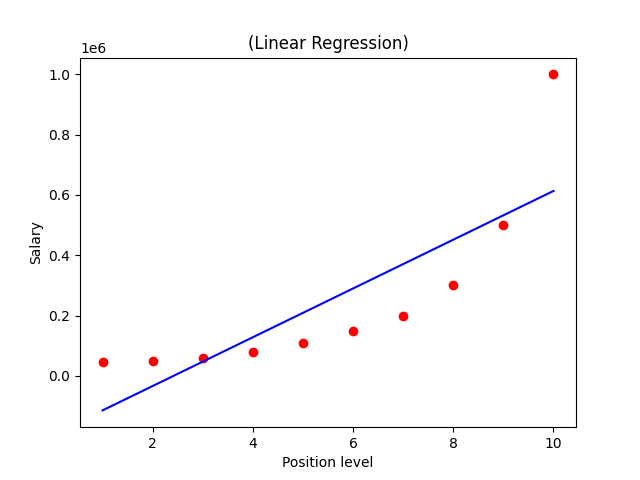
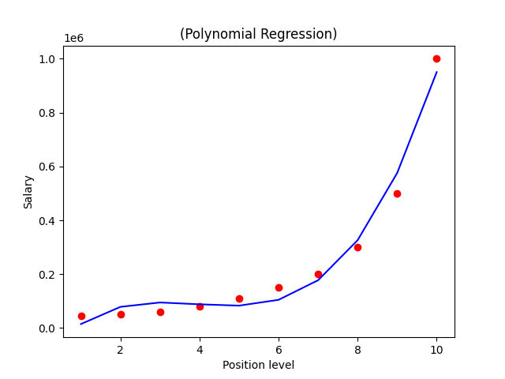

# 
Normal Equation Linear Regression 
#

## 
Overview 
##

### 
    - This Python script implements linear regression using the Normal Equation method. 
    - The script reads data from a CSV file (MarketData.csv), computes the parameters (theta values) using the normal equation, and then predicts sales based on input features. 
###

## 
Files
##

### 
    - MarketData.csv: The dataset containing the features (youtube, facebook, newspaper) and the target variable (sales).
    - normal_equation.py: The Python script implementing the normal equation for linear regression.
###

## 
Script Explanation
##

### 
    - The script loads the dataset and drops the sales column from the feature set.
    - It adds a column of ones to the feature matrix to account for the intercept term.
    - The normal equation is used to calculate the parameters (theta values) that minimize the cost function.
    - The script then predicts sales values for different combinations of youtube, facebook, and newspaper ad spends.
###

## 
Output
##

### 
    - The theta values (parameters) are printed to the console.
    - Predicted sales values are printed for three different input sets.
###

#
Polynomial Regression

##
Overview
###
This Python script implements polynomial regression to model the relationship between position levels and salaries. It compares linear regression with polynomial regression, visualizing the results using Matplotlib.
###
##

##
Files
###
    - PositionSalaries.csv: The dataset containing the position levels and corresponding salaries.
    - polynomial_regression.py: The Python script implementing polynomial regression.
###
##

##
Script Explanation
###
    - The script loads the dataset and separates the features (Position level) and the target variable (Salary).
    - It fits a simple linear regression model and visualizes the results.
    - The script then fits a polynomial regression model with a specified degree (default is 4), transforms the features, and visualizes the results.
##
##

##
Output
The script generates two plots:
###
    1- Linear Regression plot comparing actual salaries with predicted salaries.
    2- Polynomial Regression plot comparing actual salaries with predicted salaries.
###
##

##
Example Plots
###
    Linear Regression Plot: Displays a straight line fitting the data points.
    
    Polynomial Regression Plot: Displays a curved line that fits the data points more accurately.
    
###
##

#